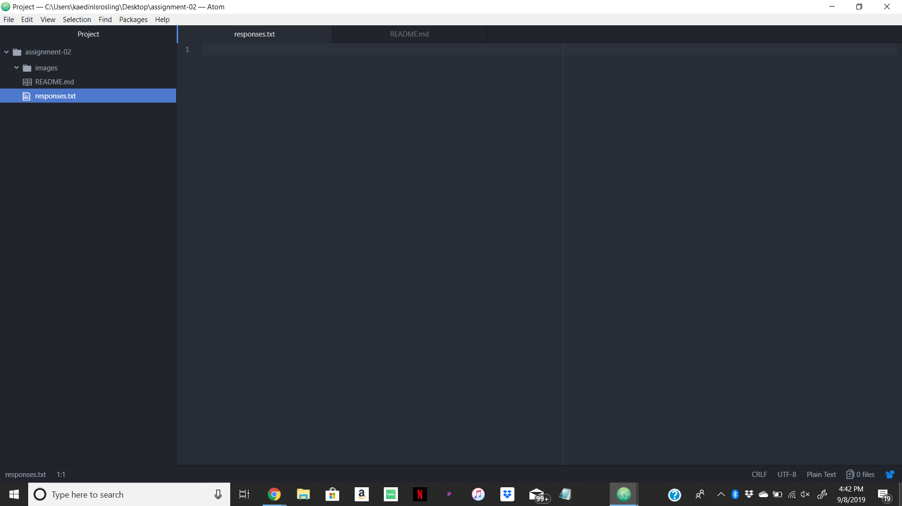

# Assignment 2
## Kaedin Rosling

I decided to take the class because it's one of the requirements for my major and I would like to own a business one day where I have the ability to create my own website.

1. I've learned the difference between an IP address and a DNS.
2. I've learned how to use git hub and also how to use atom to upload files to git hub.
3. I am hoping to learn how to create the basic functions of a fully operating website.

[Website](http://my.umt.edu/students)

[My Responses File](./responses.txt)

