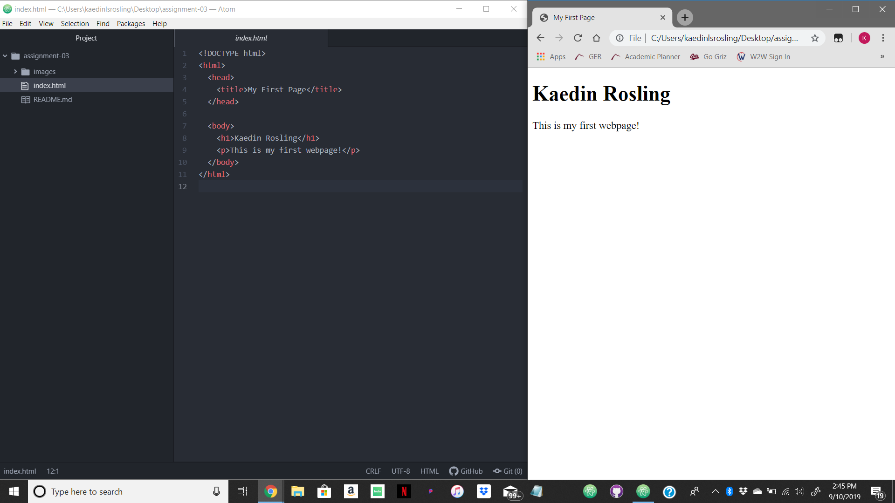

Browsers locate and retrieve content from the web server, that is then displayed on the world wide web. The browsers I use most are Safari and Google Chrome

Markup language is a system for distinguishing a document from text. HTML is a commonly used markup language because all webpages are written in favor of HTML.

