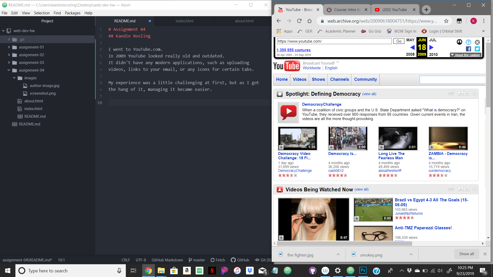

# Assignment 04
## Kaedin Rosling

I went to YouTube.com.
In 2009 YouTube looked really old and outdated.
It didn't have any modern applications, such as uploading videos, links to your email, or any icons for certain tabs.

My experience was a little challenging at first, but as I got the hang of it, managing it became easier.

