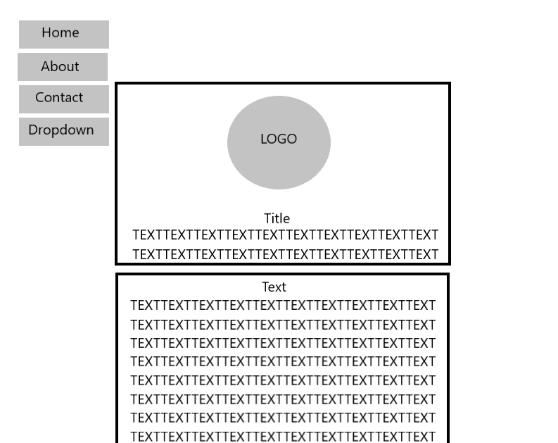

What is the difference between padding, margin, and borders?
Borders help define the amount of space a box or element takes up, then can be colored separately.
Padding is the amount of space between the inner content of the element and the element itself.
The margin is the space between the box/element and other elements, or the edge of the parent element.

Embed the image of your sketch.

Free Response: Summarize your work cycle for this assignment.
I first sketched a layout for what I wanted my website to look like, in my sketch I included site navigation, a site logo, site title, and page content.
In my index.html I added the 4 main document elements and meta elements.
I created a style.css and link to it my index.html using a relative URL.
I then created my layout, using divs, classes and ids. In my style.css, I set the size, border, padding, margin, display, position, and float of an element. Finally, I styled an element with a hover pseduo-class.
